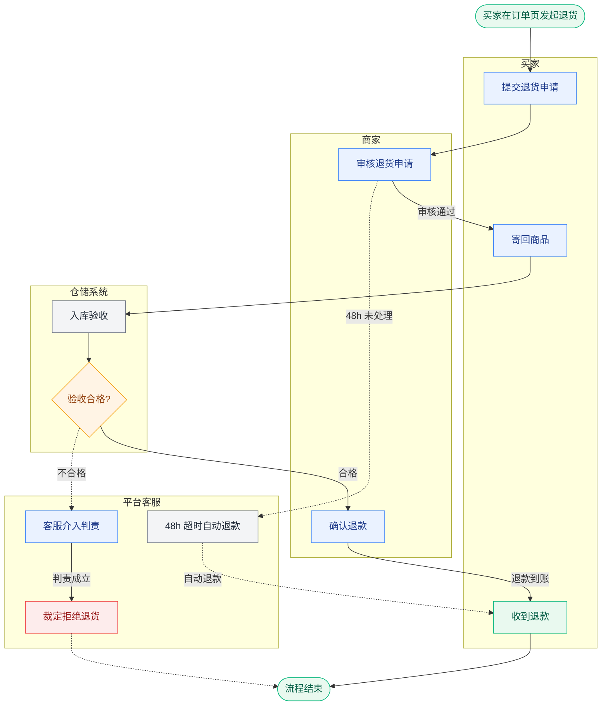

# 实例：电商退货退款跨角色泳道流程图

对应提示词：

```text
用 $laowang-diagram，绘制一张【电商退货退款】跨角色泳道流程图。涉及角色，买家、商家、平台客服、仓储系统。
必须包含，正常退货验收流程、卖家超时未处理自动退款、商品验收不合格拒收并引发客服介入 3 条分支逻辑。
输出为规范的 Mermaid flowchart 语法，并提供架构分层说明。
```

## 一、结构清单（画图前先定这个）

```text
流程名：电商退货退款
触发：买家在订单页点击「申请退货」
结束：退款到账 或 拒收裁定后流程关闭

角色：L1 买家 / L2 商家 / L3 平台客服 / L4 仓储系统

主干：
  1. 买家 → 提交退货申请 → 商家
  2. 商家 → 审核通过 → 买家
  3. 买家 → 寄回商品 → 仓储系统
  4. 仓储系统 → 入库验收合格 → 商家
  5. 商家 → 确认退款 → 买家（收到退款）

异常：
  E1 触发：商家 48h 未处理申请
     处理方：平台系统
     结果：自动退款，流程终止，不再进入验收环节
  E2 触发：仓储验收不合格
     处理方：仓储系统 → 平台客服
     结果：拒收退回，客服介入判责，裁定后流程关闭
```

## 二、Mermaid 源码



## 三、架构分层说明

### 角色层

- **买家**：发起退货、寄回商品。不参与验收判定，也不决定是否退款。
- **商家**：对「是否同意退货」负最终责任，是退款动作的唯一发起方。
- **平台客服**：仅在验收争议时介入，对「争议判责」负最终责任；不介入无争议流程。
- **仓储系统**：只提供验收结论，不决策资金动作。

### 流程层

主干 5 步，3 个跨角色交接点：买家→商家（提交申请）、商家→买家（审核通过）、买家→仓储（寄回商品）。

- 异常 E1 从「商家审核」岔出，**直接终止**，不回流主干，也不进入验收环节。
- 异常 E2 从「入库验收」岔出，**回流至平台客服**判责，裁定后终止，不回到商家退款。
- 无并行点：审核与寄回严格串行，买家必须等审核通过才能寄回。

### 系统层

- **自动动作**：48h 超时检测由平台定时任务完成，不需要人工介入。
- **人工动作**：入库验收需实物核验，由仓储人员执行，不可自动化。
- **跨系统调用**：平台订单系统 → 仓储 WMS，通过退货单号同步触发。
- **系统边界**：退款金额计算在平台侧完成，仓储系统全程不接触资金。

### 异常与边界

- **未覆盖**：买家恶意退货的识别与风控拦截。
- **未覆盖**：退款接口失败后的重试与补偿机制。
- **待确认**：48h 计时是否包含节假日。
- **待确认**：验收不合格时退回运费由谁承担。

## 四、渲染说明

- **Obsidian**：装 Diagram plugin 后，代码块直接渲染成图；双击可编辑源码。
- **在线预览**：把 Mermaid 代码贴进 <https://mermaid.live> 可导出 PNG / SVG。
- **draw.io 版本**：见同目录 `ecommerce-refund-swimlane.drawio`，有原生泳道容器，可拖拽精修。

> Mermaid 无原生 swimlane 语法，此处用 `subgraph` 模拟泳道。限制是泳道只能整块堆叠，同一角色无法在不同阶段分两次出现。需要严格泳道对齐时请用 draw.io 版本。
