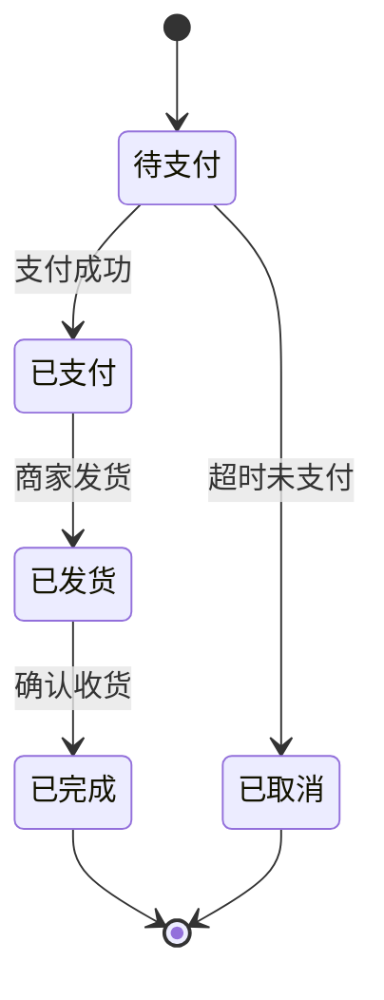

# 图型选型

同一段业务描述，选错图型会让评审会多开半小时。按下面的判断表选。

## 一、快速判断表

| 用户描述的特征 | 选图型 | Mermaid 语法 |
|---|---|---|
| 多个角色、有交接、有超时/驳回 | **跨角色泳道流程图** | `flowchart TD` + `subgraph` |
| 一串步骤、基本单角色 | 主干流程图 | `flowchart TD` |
| 单据在状态间流转、有触发事件 | 状态机图 | `stateDiagram-v2` |
| 强调系统间调用先后与返回 | 时序图 | `sequenceDiagram` |
| 强调模块上下依赖、层级 | 分层架构图 | `flowchart TD` + `subgraph` 分层 |
| 需要真泳道、要拖拽改 | 泳道图 + draw.io | `.drawio` |

## 二、泳道图 vs 主干流程图

**先问自己：图里有没有「交接」？**

- 有交接（A 做完交给 B）→ 泳道图。泳道存在的意义就是让交接点可见。
- 没交接（一个人从头做到尾）→ 主干流程图。硬套泳道只会把图撑宽。

角色数建议：

| 角色数 | 建议 |
|---|---|
| 1 | 不用泳道 |
| 2–4 | 泳道图最佳区间 |
| 5–6 | 泳道图可用，但考虑拆成主图 + 子图 |
| > 6 | 先问用户能否合并角色；否则拆图 |

## 三、流程图 vs 状态机图

判断口径：**看主语是「动作」还是「状态」。**

| 描述 | 图型 |
|---|---|
| 「买家提交申请，商家审核，审核通过后发货」 | 流程图（主语是动作） |
| 「订单从待支付 → 已支付 → 已发货 → 已完成，支付超时回到已取消」 | 状态机（主语是状态） |

状态机图的必备要素：

- 状态集合（每个状态写清进入条件）
- 触发事件（什么动作导致状态变化）
- 守卫条件（同一事件在不同条件下去向不同）
- 终态（哪些状态不再变化）

用 Mermaid 写：



## 四、流程图 vs 时序图

| 关注点 | 图型 |
|---|---|
| 业务分支、异常路径 | 流程图 |
| 调用顺序、同步/异步、超时重试 | 时序图 |

时序图用在**系统对接评审**，流程图用在**业务逻辑评审**。两者可以同时出，但不要混成一张。

## 五、泳道图 vs 分层架构图

- **泳道图**：横轴是时间/流程，纵轴是角色。回答「谁在什么时候做什么」。
- **分层架构图**：横轴是功能域，纵轴是层级。回答「系统由哪些层组成、依赖方向是什么」。

分层架构图的层序惯例（自上而下）：

```text
接入层 → 应用层 → 领域服务层 → 数据层 → 基础设施层
```

画分层架构图时，**依赖箭头只能单向**（上层依赖下层）。出现反向依赖必须在图上标出并说明，那是架构异味。

## 六、决策树

```text
有多个角色且有交接？
├─ 是 → 有超时/驳回/异常分支？
│        ├─ 是 → 跨角色泳道流程图（默认 Mermaid TD；要拖拽改则 draw.io）
│        └─ 否 → 泳道流程图（简版）
└─ 否 → 描述的是状态流转？
         ├─ 是 → 状态机图
         └─ 否 → 强调系统调用先后？
                  ├─ 是 → 时序图
                  └─ 否 → 主干流程图
```

## 七、什么时候拆图

命中任一条件就拆，不要硬塞一张：

- 节点总数 > 25
- 角色数 > 6
- 出现两个以上独立的起止对
- 主干长度 > 12 步

拆法：主图只画主干 + 关键异常，把每条异常分支单独拆成子图，用节点标注「详见子图 X」。
