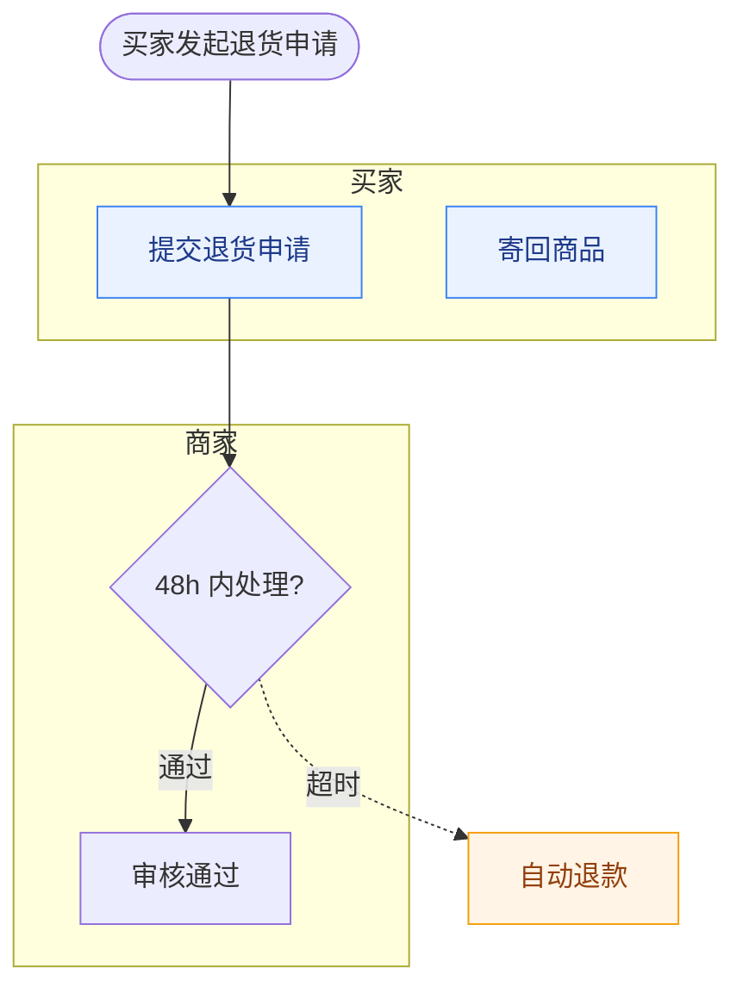

# Mermaid flowchart 规范语法规则

本文件是 `laowang-diagram` 输出 Mermaid 时的唯一语法依据。目标：**源码可直接渲染、可 diff、不报错**。

## 一、骨架

````markdown

````

## 二、硬性语法约束

### 1. 节点 ID 与标签分离

节点 ID **必须是 ASCII**：字母开头，只含字母、数字、下划线。

```text
✅ A1["提交退货申请"]      A1, M2, CS1, W1
❌ 买家1["提交申请"]        中文 ID 部分渲染器会报错
❌ 1A["提交申请"]           不能以数字开头
```

中文、括号、标点全部写进标签。**ID 是给机器看的，标签是给人看的。**

### 2. 标签含特殊字符必须加双引号

以下字符出现在标签里时，整个标签用双引号包住：

| 字符 | 例子 |
|---|---|
| `(` `)` | `A1["提交申请（48 小时内）"]` |
| `[` `]` | `A1["订单[已支付]"]` |
| `{` `}` | `A1["字段{orderId}"]` |
| `、` `，` `:` | 中文标点密集时统一加引号更稳 |
| `"` | 用 `#quot;` 转义 |

```text
✅ A1["审核通过（含风控）"]
❌ A1[审核通过（含风控）]
```

### 3. 节点形状

| 形状 | 语法 | 用途 |
|---|---|---|
| 矩形 | `A1["步骤"]` | 普通动作 |
| 圆角 | `A1("步骤")` | 一般处理 |
| 体育场形 | `A1(["开始/结束"])` | 起止节点 |
| 菱形 | `A1{"判断?"}` | 判断分支 |
| 圆形 | `A1(("汇合点"))` | 连接点、汇合 |

判断节点一律用菱形 `{}`，起止一律用 `([])`。

### 4. 连边

| 语义 | 语法 |
|---|---|
| 主干（正常路径） | `A1 --> B1` |
| 主干带标签 | `A1 -->|"通过"| B1` |
| 异常 / 可选路径 | `A1 -.->|"超时"| E1` |
| 强调异常 | `A1 ==> E1` |

**虚线 `-.->` 只用于异常与可选路径。** 主干全用实线，否则一眼看不出哪条是正常路径。

### 5. subgraph 泳道

```text
subgraph L1["买家"]
    direction LR
    A1["提交退货申请"]
    A2["寄回商品"]
end
```

规则：

- `subgraph` 的 ID 用 ASCII（`L1`、`L2`），泳道显示名写在中括号里且加引号。
- 每个 `subgraph` 必须有对应 `end`。**配平是最高频的渲染失败原因。**
- `direction LR` 可选，用于让泳道内节点横向排列。嵌套 `direction` 在部分渲染器上不生效，不要依赖它。
- 不要把节点写在 `subgraph` 外面又用 `class` 指进泳道。

### 6. 语义配色 classDef

固定四组，含义不要串：

```text
classDef start fill:#E9F9EF,stroke:#10B981,color:#065F46   // 起止、成功结果
classDef role  fill:#EAF2FF,stroke:#3B82F6,color:#1E3A8A   // 角色动作
classDef sys   fill:#F3F4F6,stroke:#6B7280,color:#1F2937   // 系统/后台
classDef warn  fill:#FFF4E5,stroke:#F59E0B,color:#92400E   // 异常、超时、待判断
classDef risk  fill:#FDECEC,stroke:#EF4444,color:#991B1B   // 失败、拒收、终止
```

用法：`class A1,A2 role`，多个 ID 用逗号分隔。

**不要用随机颜色**，颜色必须承担语义。

### 7. 注释

```text
%% 这是注释，不会渲染
```

只在需要标注分区时用，不要写成长段落。

## 三、禁用写法

| 禁用 | 原因 | 替代 |
|---|---|---|
| 中文节点 ID | 部分渲染器解析失败 | ASCII ID + 中文标签 |
| 标签内裸括号 | 语法歧义 | 加双引号 |
| `end` 漏写 | 整图渲染失败 | 写完立刻跑自检脚本 |
| 节点 ID 与 Mermaid 关键字重名（`end`、`graph`、`subgraph`、`class`、`default`、`style`、`linkStyle`） | 解析冲突 | 加前缀，如 `end1` 改成 `E1` |
| 同一 ID 定义两次且标签不同 | 后定义覆盖，行为不确定 | 一个节点只定义一次 |
| 未加引号的标签里含 `--` | 被解析成连边 | 加引号 |
| 混用 `flowchart` 与 `graph` | 同一文件里方向语义不一致 | 统一用 `flowchart` |
| 把长句塞进节点 | 渲染后文字溢出 | 标签 ≤ 18 汉字，细节移入分层说明 |

## 四、布局方向选择

| 写法 | 效果 | 适用 |
|---|---|---|
| `flowchart TD` | 泳道上下堆叠（横向泳道带），主干自上而下 | **默认**。最接近跨职能泳道图观感 |
| `flowchart LR` | 泳道左右并列（纵向泳道列），主干自左而右 | 角色少（2–3 个）、强调跨角色左右交接 |
| `flowchart TB` | 同 `TD` | 同 `TD` |

选哪个取决于用户要投屏还是打印。**不确定就用 `TD`。**

## 五、自检

写完必须跑：

```bash
python3 scripts/check_mermaid.py path/to/diagram.mmd
```

脚本检查项：

- `subgraph` 与 `end` 是否配平
- 节点 ID 是否合法 ASCII、是否命中关键字黑名单
- 标签是否含未转义的裸括号
- 是否存在只有出边没有入边的孤岛节点（起止节点除外）
- 是否存在只被定义、从未被引用的死节点

自检不通过不要交付。
