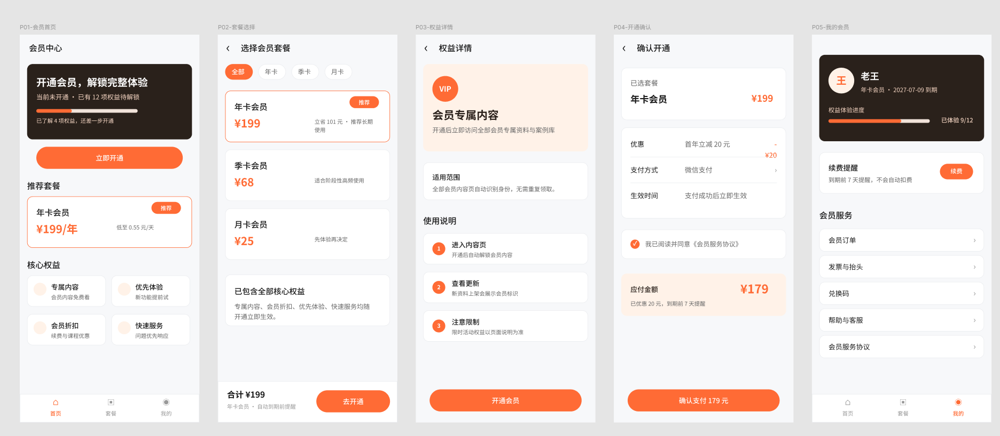

# PM Prototype Skill

一个用于生成 B/C 端产品原型的 Codex Skill，重点面向 Figma 可编辑 UI 原型。

它把原型生成拆成稳定流程：

- IA 推导：从 brief 推实体、角色、任务链和页面，不套固定后台页面清单。
- Design Plan：先确定 subject、tone、token、layout、signature、differentiation。
- Anti-Slop Review：生成 Figma 前先检查是否落入常见 AI 默认审美。
- `page.ui.yaml`：用结构化页面规格承接后续增量修改。
- Figma 执行：按 region 分批生成可编辑 Frame。

## Repository Structure

```text
.
├── SKILL.md
├── DESIGN.md
├── references/
├── schema/
└── templates/
```

## Requirements

- Codex / Agent 环境支持 Skill 加载。
- 如需写入 Figma，需要已配置 Figma MCP / Figma 插件，并可用 `figma-use`、`figma-generate-design`、`figma-create-new-file` 等能力。
- 本 Skill 继承 `frontend-design` 的设计思路；如果宿主环境没有该 Skill，可按 `DESIGN.md` 与 `references/frontend-design-gates.md` 执行同等检查。

## Usage

把本仓库作为 Skill 放入你的 Codex skills 目录，然后在任务里指定：

```text
使用产品原型生成 Skill，生成一个会员系统前台页面原型
```

典型产出：

- `ia-draft.md`
- `design-plan.md`
- `{page-id}.page.ui.yaml`
- Figma 文件链接与 Frame nodeId

## Examples

> 注意：这里生成的是产品原型图，还达不到最终 UI 稿的程度。后续如果要用于展示、投放或正式交付，建议再次使用 gptimage2 或 Stitch 生成更完整、更精致的 UI 图。
>
> 产品经理在工作协作时，不建议直接拿这个当 UI 图交付给设计师；它更适合作为需求沟通、信息架构、页面流程和布局意图的原型材料。设计师会恨你的。

### Member System Frontend



会员系统前台页面原型案例，包含 IA、Design Plan 和 5 个 `page.ui.yaml` 页面规格。

[案例目录](examples/member-system-frontend/) · [IA](examples/member-system-frontend/ia-draft.md) · [Design Plan](examples/member-system-frontend/design-plan.md)

### Inventory System Backend


库存系统 B 端原型截图案例，展示库存总览、预警优先级队列、库存动作流、入库管理筛选和表格结构。

[案例目录](examples/inventory-system-backend/)

### AI Price Comparison Frontend

AI 比价前台页面原型案例，包含淘宝式 C 端视觉、IA、Design Plan、5 个 `page.ui.yaml` 页面规格和本地 HTML 预览。

[案例目录](examples/ai-price-comparison-frontend/) · [IA](examples/ai-price-comparison-frontend/ia-draft.md) · [Design Plan](examples/ai-price-comparison-frontend/design-plan.md) · [HTML Preview](examples/ai-price-comparison-frontend/index.html)

## Design Principles

- 先推导 IA，再画页面。
- B 端和 C 端使用不同视觉轨道。
- 无 `design-plan.md` 不生成 Figma。
- Anti-Slop 非 PASS 不生成 Figma。
- 增量修改先更新 plan / yaml，再 patch Figma。

## License

MIT
