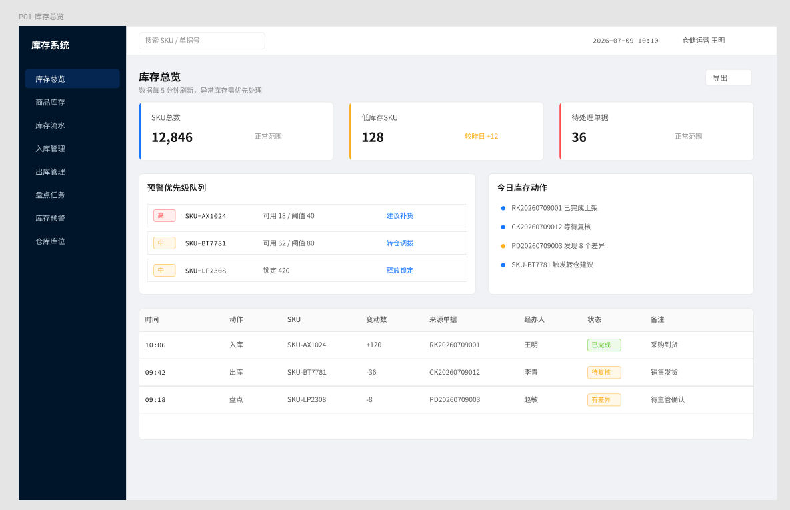
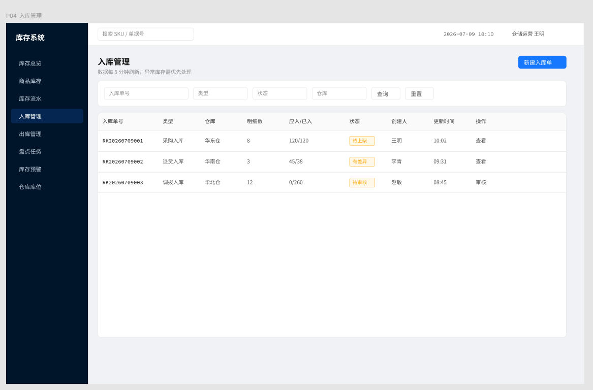

# Inventory System Backend Example

库存系统 B 端原型截图案例，展示后台管理类产品的页面结构与信息密度。

> 注意：这是产品原型图，不是最终 UI 稿。正式展示或交付前，建议再使用 gptimage2 或 Stitch 做视觉精修。
>
> 产品经理使用时，应把它作为需求沟通、页面流程和布局意图材料，不建议直接当 UI 稿交给设计师。

## Preview

### 库存总览

### 入库管理

## Notes

- surface: `b_end`
- 画布：后台桌面端
- 页面：库存总览、入库管理
- 适用：库存管理、仓储运营、后台页面原型沟通
